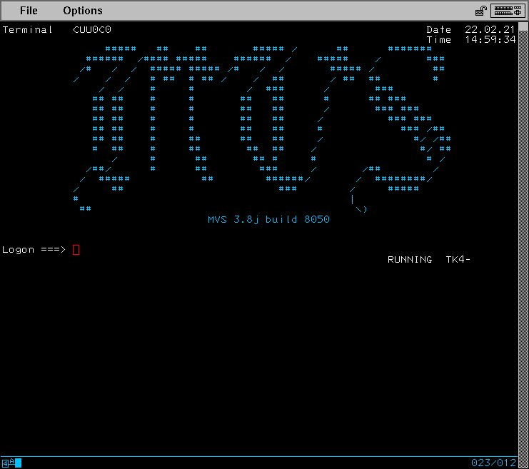

# MVS 3.8j NETSOL screen generator
This repository contains a simple Makefile compatible with GNU or BSD Make,
a Perl script, and a slightly modified copy of ```SYS2.CNTL(TK4-LOGO)``` which
is used as input to the M4 macro processor. To change the screen that is
generated, you must change what is executed for the ```screen``` target in the
Makefile. Currently, it executes ```figlet``` to generate the main text, and
uses BSD ```fmt``` to center the trailing text. The ```fmt``` provided by
the ```GNU Coreutils``` _does not supply a centering option_, and thus, will
not work.

```Makefile
screen: Makefile
	figlet -c -w 80 -f calgphy2 MVS | sed -e '/^[[:blank:]]*$$/d' > screen
	echo "MVS 3.8j build 8050" | fmt -80 -c >> screen
```

If you use ```figlet```, I highly recommend retaining the ```sed``` pipeline.
The ```figlet``` program tends to add empty lines, and considering we have only
24 to work with, three of which are already used, removing them makes sense.

The ```mknetsol``` script accounts for the lines already used, and will only
output enough to fill the screen, without overflowing the ```Logon``` line.
This is important because if you overshoot without unprotecting the screen,
you will be unable to login.

## Screenshot
|

# Figlet Fonts
I have found that for more compact text that still looks reasonable, the
clr6x6 and cybermedium fonts are quite reasonable, with cybermedium being
the smaller of the two. cybersmall can also be used, but I don't find it to be
legible enough for most uses. If you find any ```figlet``` fonts (or other
ASCII art text generators) that look good and are reasonably compact, feel
free to submit a pull request to add them into this section.

# Thanks
My thanks to Gerard Wassink and his article on customizing the MVS NETSOL screens,
upon which this is loosely based. You can find the article here:
[Customize MVS logon screen](https://geronimo370.nl/s370/mvs-multiple-virtual-storage/customize-mvs-logon-screen)

# License
This license applies only to the code I have written, not to the screen.m4
which was taken from MVS 3.8j and lightly modified.

```
  Copyright (c) 2021 B. Atticus Grobe (grobe0ba@gmail.com)

  Permission to use, copy, modify, and distribute this software for any
  purpose with or without fee is hereby granted, provided that the above
  copyright notice and this permission notice appear in all copies.

  THE SOFTWARE IS PROVIDED "AS IS" AND THE AUTHOR DISCLAIMS ALL WARRANTIES
  WITH REGARD TO THIS SOFTWARE INCLUDING ALL IMPLIED WARRANTIES OF
  MERCHANTABILITY AND FITNESS. IN NO EVENT SHALL THE AUTHOR BE LIABLE FOR
  ANY SPECIAL, DIRECT, INDIRECT, OR CONSEQUENTIAL DAMAGES OR ANY DAMAGES
  WHATSOEVER RESULTING FROM LOSS OF USE, DATA OR PROFITS, WHETHER IN AN
  ACTION OF CONTRACT, NEGLIGENCE OR OTHER TORTIOUS ACTION, ARISING OUT OF
  OR IN CONNECTION WITH THE USE OR PERFORMANCE OF THIS SOFTWARE.
```
